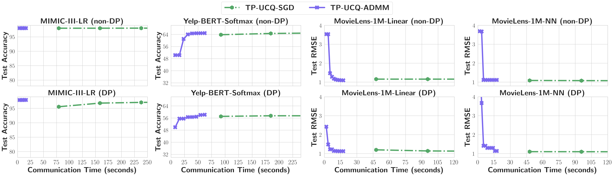
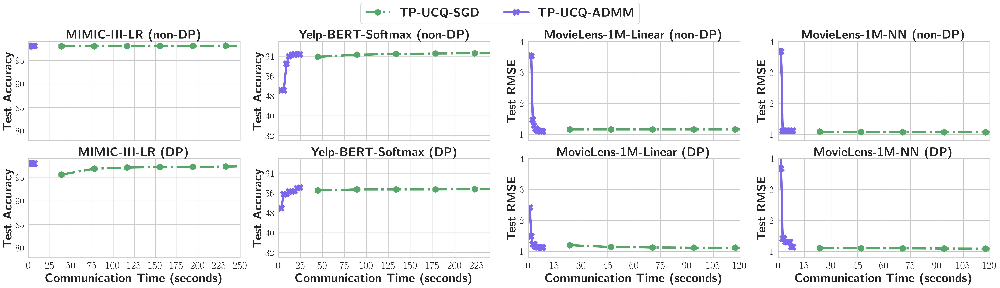

# TablePuppet

This is the code repository for *TablePuppet*.

## Test Dataset

We conducted tests on these three datasets:

1. MIMIC-III
2. Yelp
3. MovieLens-1M

We obtained the original dataset from the official site and performed some preprocessing (the preprocessing code is available in the *preprocess* directory) to convert all data into a numerical format that can be easily processed by the model.

The table size for each dataset is listed below:

| Dataset      | Joint table                   | Individual tables                                                                                                                      |
| ------------ | ----------------------------- | -------------------------------------------------------------------------------------------------------------------------------------- |
| MIMIC-III    | Tuples: 2,908,992, Size: 24G  | Stays: 52,302 (7.5M)<br>Patients: 46,520 (399K) <br> Admissions: 58,976 (5.1M)<br> Diagnoses: 58,925 (15M)<br> Events: 3,431,622 (27G) |
| Yelp         | Tuples: 3,207,696, Size: 31G  | Review: 3,207,696 (31.7G) <br> Restaurant: 34,987 (2.1M)<br> User: 1,158,106 (97M)                                                     |
| MovieLens-1M | Tuples: 1,786,513, Size: 960M | Ratings: 850,177 (22.3M) <br> Movies_genres_split: 6,408 (4.8M)<br> Users: 6,040 (312K)                                                |  |


The join key for each table is listed below:
| Dataset      | Table               | Table schema and \<join keys\>                                                                                                                                                 |
| ------------ | ------------------- | ------------------------------------------------------------------------------------------------------------------------------------------------------------------------------ |
| MIMIC-III    | stays               | \<SUBJECT_ID, HADM_ID, ICUSTAY_ID\>, LOS, MORTALITY, ...                                                                                                                       |
|              | patients            | \<SUBJECT_ID\>, GENDER                                                                                                                                                         |
|              | admissions          | \<HADM_ID\>, ETHNICITY_AMERICAN INDIAN/ALASKA NATIVE, ETHNICITY_AMERICAN INDIAN/ALASKA NATIVE FEDERALLY RECOGNIZED TRIBE, ETHNICITY_ASIAN, ETHNICITY_ASIAN - ASIAN INDIAN, ... |
|              | diagnoses           | \<HADM_ID\>, Diagnosis 4019, Diagnosis 4280, Diagnosis 41401, Diagnosis 42731, ...                                                                                             |
|              | events              | \<ICUSTAY_ID\>, HOUR, LABEL, 1, 2, ...                                                                                                                                         |
| Yelp         | review              | \<review_id, user_id, business_id\>, useful, funny, ...                                                                                                                        |
|              | restaurant          | \<business_id\>, stars, review_count                                                                                                                                           |
|              | user                | \<user_id\>, review_count, useful, funny, cool, ...                                                                                                                            |
| MovieLens-1M | ratings             | \<userid, movieid\>, rating, timestamp                                                                                                                                         |
|              | movies_genres_split | \<movieid\>, year, Action, Adventure, Animation, ...                                                                                                                           |
|              | users               | \<userid\>, gender, age, occupation_0, occupation_1, ...                                                                                                                       |  |

## Run

### TP-Join-ADMM

```sh
python run/admm.py <path to dataset> --dataset=<dataset name>
```

The \<path to dataset> argument should be the directory path where the *train* directory and *test* directory are located.

### TP-UCQ-ADMM

In the join-union scenario, the number of horizontally split parts can be specified using the *client_num* argument, as shown below:

```sh
python run/admm.py <path to dataset> --dataset=<dataset name> --client_num=2
```

### VFL-ADMM

VFL-ADMM can be regarded as TP-Join-ADMM without computation reduction and communication reduction. For simplicity, we align the client data (expanding it to N) and represent G as [[0], [1], ..., [M]] for the implementation of VFL-ADMM.

```sh
python run/admm.py <path to dataset> --dataset=<dataset name> --simulate_VFL_ADMM=True
```

### VFL-SGD

```sh
python run/sgd.py <path to dataset> --dataset=<dataset name>
```

### Differential Privacy (DP)

To enable differential privacy (DP):

For **feature DP**: add the *--use_DP=True* flag and specify the *max_per_sample_clip_norm* and *target_epsilon values*. For example:

```sh
python run/admm.py <path to dataset> --dataset=<dataset name> --use_DP=True --max_per_sample_clip_norm=1 --target_epsilon=1
```

For **label DP**: add the *--use_label_DP=True* flag and specify the noise level *label_DP_sigma*. For example:

```sh
python run/admm.py <path to dataset> --dataset=<dataset name> --use_label_DP=True --label_DP_sigma=0.5
```

## Results

### Hyper-Parameters

We conducted a grid search on hyperparameters using the following configurations for ADMM and SGD:

For ADMM:

```yaml
local_lr:
    values: [0.01, 0.05, 0.1, 0.5]
rho:
    values: [0.1, 0.2, 0.5, 1, 2, 5, 10]
model:
    values: [Linear, MLP]
```

For SGD:

```yaml
lr:
    values: [0.01, 0.05, 0.1, 0.5]
batch_size:
    values: [1024, 10240]
model:
    values: [Linear, MLP]
```

We tested [VFL-SGD, VFL-ADMM, TP-Join-ADMM, TP-UCQ-ADMM] in both DP(only feature DP and both feature DP and label DP) and non DP scenarios.

### Convergence Rates

#### Results without privacy guarantee

The figure below illustrates the convergence rates of different SGD/ADMM algorithms atop TablePuppet without privacy guarantee. In this non-DP scenario, all the algorithms can converge to model accuracy comparable to the baselines, which demonstrates the effectiveness of TablePuppet.

|                         .png)                          |
| :--------------------------------------------------------------------------------------------------------------------------: |
|                      .png)                       |
| *Figure 1: The convergence rates of different algorithms for  join-only and join-union scenarios without privacy guarantees* |

#### Results with privacy guarantee

By introducing DP to both labels and model training in TablePuppet, the model accuracy of SGD/ADMM drops compared to the non-DP centralized baselines. However, with model accuracy drops, these algorithms gain privacy protection against feature and label leakages. In this DP scenario, we can still observe that all algorithms atop TablePuppet can converge to similar model accuracy.

|                           .png)                            |
| :----------------------------------------------------------------------------------------------------------------------: |
|                        .png)                         |
| *Figure 2: The convergence rates of different algorithms for join-only and join-union scenarios with privacy guarantees* |

### Communication Time

We compare model accuracy vs. communication time, among SGD and ADMM algorithms in both join-only and join-union scenarios. We presume that the server and clients are distributed in US/UK, and we use two network settings, US-UK and US-US with different latency and bandwidth, to measure the communication between the server and clients. We measure the communication time via “*latency + communication_data_size / bandwidth*” for each epoch. Note that VFL-SGD results are not fully plotted in the figure, due to the long communication time caused by too many communication rounds per epoch. In addition, we observe similar results in both non-DP and DP scenarios, which indicates that privacy guarantee does not affect the number of communication rounds and cost.

|                                               |
| :--------------------------------------------------------------------------------------------------------------------: |
| *Figure 3: The model accuracy vs. communication time for join-only (US-UK with latency = 136ms, bandwidth = 0.42Gb/s)* |

|                                             |
| :------------------------------------------------------------------------------------------------------------------: |
| *Figure 4:The model accuracy vs. communication time for join-only (US-US with latency = 67ms, bandwidth = 1.15Gb/s)* |

|                                          |
| :---------------------------------------------------------------------------------------------------------------------: |
| *Figure 5: The model accuracy vs. communication time for join-union (US-UK with latency = 136ms, bandwidth = 0.42Gb/s)* |

|                                         |
| :--------------------------------------------------------------------------------------------------------------------: |
| *Figure 6: The model accuracy vs. communication time for join-union (US-US with latency = 67ms, bandwidth = 1.15Gb/s)* |

## How to test on a new dataset

1. Obtain the original table-type data, with each table stored in a CSV file.

2. Perform data preprocessing to ensure that the data in each table is numerical and can be processed by the model.

3. Shuffle and split the training data and test data. The final dataset should be organized in the following structure:

   ```
   ADMM/
   ├── train/
   │   ├── table_name_1.csv
   │   ├── table_name_2.csv
   │   ├── table_name_3.csv
   │   └── ...
   └── test/
       ├── table_name_1.csv
       ├── table_name_2.csv
       ├── table_name_3.csv
       └── ...
   ```

   As we will perform logical joins, you can perform the train-test split on just one table.

4. Create a file in the dataset directory and provide *table_name_join_key_mapping*, *label_info*, *num_class*, and *task* (which can either be *classification* or *regression*), as shown below:

   ```python
   table_name_join_key_mapping = {
       'stays': ["SUBJECT_ID", "HADM_ID", "ICUSTAY_ID"],
       'patients': ['SUBJECT_ID'],
       'admissions': ['HADM_ID'],
       'diagnoses': ['HADM_ID'],
       'events': ['ICUSTAY_ID']
   }
   label_info = { 'stays': 'MORTALITY' }
   num_class = 2
   task = 'classification'
   ```

5. Overwrite the *build_mapping* method to specify how to join the tables together, as demonstrated below:

   ```python
   def build_mapping(self, table_meta_dict):
       table_index_mapping = pd.merge(table_meta_dict["stays"], table_meta_dict["patients"], on="SUBJECT_ID") \
       .merge(table_meta_dict["admissions"], on="HADM_ID") \
       .merge(table_meta_dict["diagnoses"], on="HADM_ID") \
       .merge(table_meta_dict["events"], on="ICUSTAY_ID") \
       .reset_index()
       f = table_index_mapping.drop(["SUBJECT_ID", "HADM_ID", "ICUSTAY_ID"], axis=1).values # Drop join keys
       G = self.get_G(table_index_mapping, table_meta_dict)
       return f, G, table_index_mapping
   ```

6. Import the dataset class into *_init_.py* under the dataset directory, like this:

   ```python
   from .mimic import MIMIC
   ```

7. Import the dataset and create a dataset object in the *run.py*, as shown below:

   ```python
   from dataset import MIMIC
   if args.dataset == 'MIMIC-III':
   	dataset = MIMIC()
   ```
